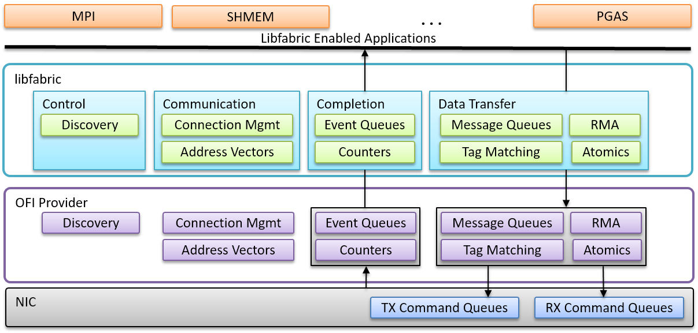



Latest releases
===============

* The libfabric library, unit tests, and documentation: [libfabric v2.2.0](https://github.com/ofiwg/libfabric/releases/tag/v2.2.0) (or [see all prior releases](https://github.com/ofiwg/libfabric/releases/)).

Since 2025, libfabric follows a quarterly release schedule, with major releases in March, June, September, and December (Previously there were three major releases per year: March, July, and November).  The timing of a specific release may be adjusted based on the readiness of the underlying providers, but current guideline is to have RC1 out on the 1st of the month, and the GA release on the 15th of the month.

Overview
========

Libfabric, also known as Open Fabrics Interfaces (OFI), defines a communication API for high-performance parallel and distributed applications.  It is a low-level communication library that abstracts diverse networking technologies.  Libfabric is developed by the OFI Working Group (OFIWG, pronounced "o-fee-wig"), a subgroup of the [OpenFabrics Alliance - OFA](http://www.openfabrics.org/).  Participation in the OFIWG is open to anyone, and not restricted to members of OFA.

The goal of libfabric is to define interfaces that enable a tight semantic map between applications and underlying fabric services.  Specifically, libfabric software interfaces have been co-designed with fabric hardware providers and application developers, with a focus on the needs of HPC users.  Libfabric supports multiple communication semantics, is fabric and hardware implementation agnostic, and leverages and expands the existing RDMA open source community.

Libfabric is designed to minimize the impedance mismatch between applications, including middleware such as MPI, SHMEM, data storage, and PGAS, and fabric communication hardware.  Its interfaces target high-bandwidth, low-latency NICs, with a goal to scale to tens of thousands of nodes.

Libfabric targets support for the Linux, Free BSD, Windows, and OS X.  A reasonable effort is made to support all major, modern Linux distributions; however, validation is limited to the most recent 2-3 releases of Red Hat Enterprise Linux (RHEL) and SUSE Linux Enterprise Server (SLES).  Support for a particular operating system version or distribution is vendor specific.  The exceptions are the tcp and udp based socket providers are available on all platforms.

Developer Resources
===================

A comprehensive developer's guide is included with the man pages.

* [Developer Guide](main/man/fi_guide.7.html)

A set of man pages have been carefully written to specify the libfabric API.

* [Man pages for v2.2.0](v2.2.0/man/)
  * Older: [Man pages for v2.1.0](v2.1.0/man/)
  * Older: [Man pages for v2.0.0](v2.0.0/man/)
  * Older: [Man pages for v1.22.0](v1.22.0/man/)
  * Older: [Man pages for v1.21.1](v1.21.1/man/)
  * Older: [Man pages for v1.21.0](v1.21.0/man/)
  * Older: [Man pages for v1.20.2](v1.20.2/man/)
  * Older: [Man pages for v1.20.1](v1.20.1/man/)
  * Older: [Man pages for v1.20.0](v1.20.0/man/)
  * Older: [Man pages for v1.19.1](v1.19.1/man/)
  * Older: [Man pages for v1.19.0](v1.19.0/man/)
  * Older: [Man pages for v1.18.3](v1.18.3/man/)
  * Older: [Man pages for v1.18.2](v1.18.2/man/)
  * Older: [Man pages for v1.18.1](v1.18.1/man/)
  * Older: [Man pages for v1.18.0](v1.18.0/man/)
  * Older: [Man pages for v1.17.1](v1.17.1/man/)
  * Older: [Man pages for v1.17.0](v1.17.0/man/)
  * Older: [Man pages for v1.16.1](v1.16.1/man/)
  * Older: [Man pages for v1.16.0](v1.16.0/man/)
  * Older: [Man pages for v1.15.2](v1.15.2/man/)
  * Older: [Man pages for v1.15.1](v1.15.1/man/)
  * Older: [Man pages for v1.15.0](v1.15.0/man/)
  * Older: [Man pages for v1.14.1](v1.14.1/man/)
  * Older: [Man pages for v1.14.0](v1.14.0/man/)
  * Older: [Man pages for v1.13.2](v1.13.2/man/)
  * Older: [Man pages for v1.13.1](v1.13.1/man/)
  * Older: [Man pages for v1.13.0](v1.13.0/man/)
  * Older: [Man pages for v1.12.1](v1.12.1/man/)
  * Older: [Man pages for v1.12.0](v1.12.0/man/)
  * Older: [Man pages for v1.11.2](v1.11.2/man/)
  * Older: [Man pages for v1.11.1](v1.11.1/man/)
  * Older: [Man pages for v1.11.0](v1.11.0/man/)
  * Older: [Man pages for v1.10.1](v1.10.1/man/)
  * Older: [Man pages for v1.10.0](v1.10.0/man/)
  * Older: [Man pages for v1.9.1](v1.9.1/man/)
  * Older: [Man pages for v1.9.0](v1.9.0/man/)
  * Older: [Man pages for v1.8.1](v1.8.1/man/)
  * Older: [Man pages for v1.8.0](v1.8.0/man/)
  * Older: [Man pages for v1.7.2](v1.7.2/man/)
  * Older: [Man pages for v1.7.1](v1.7.1/man/)
  * Older: [Man pages for v1.7.0](v1.7.0/man/)
  * Older: [Man pages for v1.6.2](v1.6.2/man/)
  * Older: [Man pages for v1.6.1](v1.6.1/man/)
  * Older: [Man pages for v1.6.0](v1.6.0/man/)
  * Older: [Man pages for v1.5.4](v1.5.4/man/)
  * Older: [Man pages for v1.5.3](v1.5.3/man/)
  * Older: [Man pages for v1.5.2](v1.5.2/man/)
  * Older: [Man pages for v1.5.1](v1.5.1/man/)
  * Older: [Man pages for v1.5.0](v1.5.0/man/)
  * Older: [Man pages for v1.4.2](v1.4.2/man/)
  * Older: [Man pages for v1.4.1](v1.4.1/man/)
  * Older: [Man pages for v1.4.0](v1.4.0/man/)
  * Older: [Man pages for v1.3.0](v1.3.0/man/)
  * Older: [Man pages for v1.2.0](v1.2.0/man/)
  * Older: [Man pages for v1.1.1](v1.1.1/man/)
  * Older: [Man pages for v1.1.0](v1.1.0/man/)
  * Older: [Man pages for v1.0.0](v1.0.0/man/)
* [Man pages for current head of development](main/man/)

[Set of test applications](https://github.com/ofiwg/libfabric/tree/main/fabtests) - These tests focus on validating libfabric development, but also highlight how an application might use various aspects of libfabric.

Additionally, developers may find the documents listed below useful in understanding the libfabric architecture and objectives in more detail.

* [Feb 2019 OFA Webinar: Overview of libfabric](https://www.slideshare.net/seanhefty/ofi-overview-2019-webinar) - general introduction to libfabic.
* [A Short Introduction to the libfabric Architecture](https://www.slideshare.net/seanhefty/ofi-overview) - recommended for anyone new to libfabric.
* [Developer Tutorial - from HOTI '17](https://www.slideshare.net/seanhefty/2017-ofihotitutorial) - walks through design guidelines, architecture, followed by middleware use cases (PGAS and MPICH)
* [Developer Tutorial - from SC '15](https://www.slideshare.net/dgoodell/ofi-libfabric-tutorial) - walks through low-level interface details, followed by examples of application and middleware (MPI, SHMEM) using the APIs.
* [Starting Guide for Writing to libfabric](https://www.slideshare.net/JianxinXiong/getting-started-with-libfabric)

Open Collaboration
==================

The libfabric code base is being developed in [the main OFIWG libfabric GitHub repository](https://github.com/ofiwg/libfabric).  There are two mailing lists for OFIWG discussions:

* [The Libfabric users mailing list](http://lists.openfabrics.org/mailman/listinfo/libfabric-users) - intended for general user questions about the Libfabric library, to include questions from developers trying to use libfabric in their applications.
* [The OFI working group mailing list](http://lists.openfabrics.org/mailman/listinfo/ofiwg) - used for the discussion and development of the OFI APIs themselves, and by extension, the continued development of the libfabric library.

Notices of the every-other-Tuesday OFIWG Webexes are sent to the OFIWG mailing list.  Anyone can join the calls to listen and participate in the design of Libfabric.  Webex information is available from the OpenFabrice Alliance calendar.

