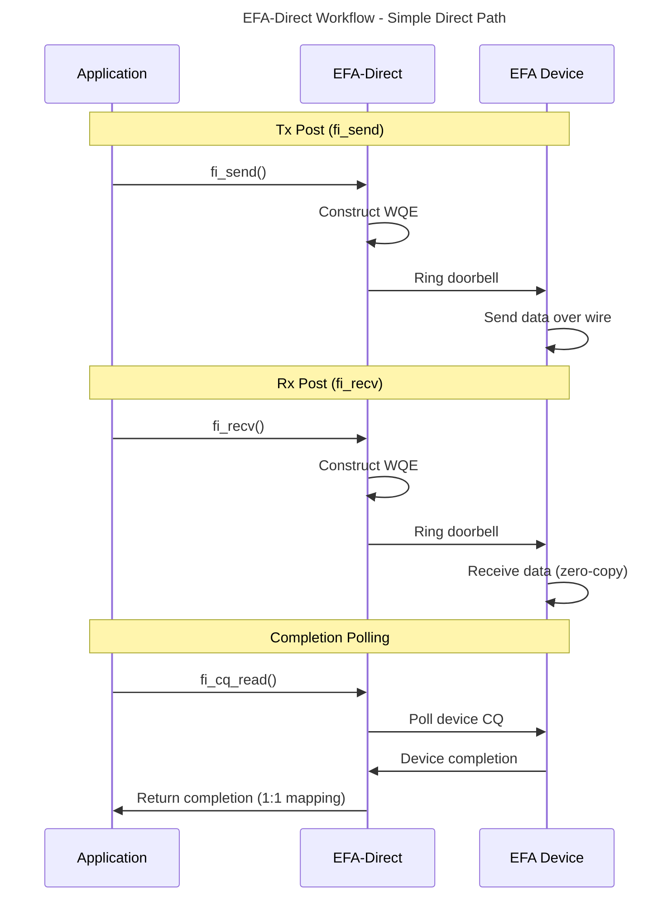
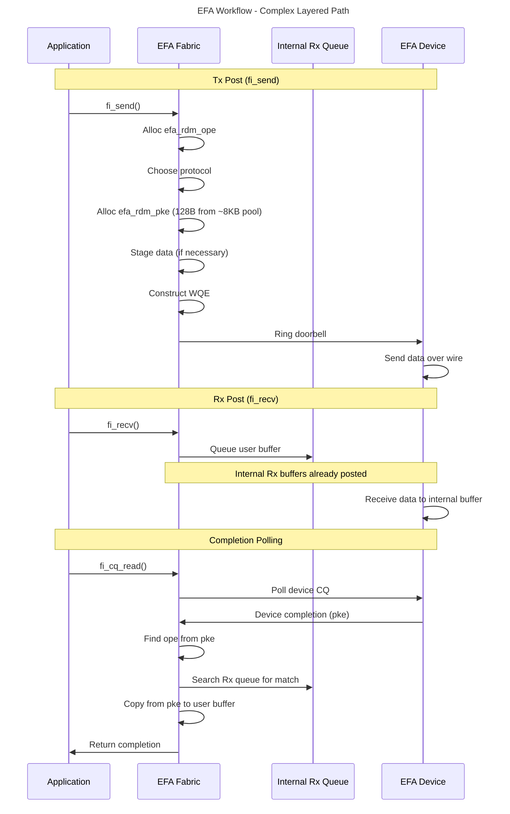

# EFA vs EFA-Direct Fabric Comparison

## Overview

The Libfabric EFA provider provides an interface to access the Elastic Fabric Adapter (EFA) NIC produced by AWS. The EFA NIC supports both two-sided and one-sided RDMA using a proprietary protocol called [Scalable Reliable Datagram (SRD)](https://ieeexplore.ieee.org/document/9167399). The EFA provider in libfabric offers two distinct fabric types: `efa` and `efa-direct`. Both fabrics provide RDM (reliable datagram) endpoint type, but they differ in their implementation approach and code path complexity.

The **`efa` fabric** implements a comprehensive set of [wire protocols](efa_rdm_protocol_v4.md) that include emulations to support capabilities beyond what the EFA device natively provides. This allows broader libfabric feature support and application compatibility, but results in a more complex code path with additional protocol overhead.

The **`efa-direct` fabric** offers a more direct approach that mostly exposes only what the EFA NIC hardware natively supports. This results in a more compact and efficient code path with reduced protocol overhead, but requires applications to work within the constraints of the hardware capabilities.

## Basic Workflow

The data transfer path in libfabric can be roughly divided into two categories: work request (WR) post and completion polling. Operations like `fi_send`/`fi_recv`/`fi_write`/`fi_read` fall into the first category, while `fi_cq_read` and its variants fall into the second category. The WR post can be further devided into Tx (fi_send/write/read) and Rx (fi_recv) post.

### EFA-Direct Workflow

EFA-direct provides a straightforward, direct mapping to hardware operations:

**Tx Post:**
- Constructs Work Queue Entry (WQE) directly from application calls (`fi_*` functions)
- Maintains 1-to-1 mapping between WQE and libfabric call
- Only performs two operations before data is sent to the NIC:
  1. Construct WQE
  2. Ring the doorbell (when required)

**Rx Post:**
- No internal Rx buffers - each `fi_recv` call is constructed as WQE and posted directly to device
- User buffers from `fi_recv` calls are directly used by hardware
- Zero-copy receive path with direct data placement

**Completion Polling:**
- Maintains 1-to-1 mapping between device completions and libfabric completions
- Polls the device CQ directly
- Generates libfabric CQ entry from device completion

### EFA Workflow

EFA fabric implements a more complex, layered approach with protocol emulation:

**Tx Post:**
- Allocates internal data structure called `efa_rdm_ope` (EFA-RDM operational entry)
- Maintains 1-to-1 mapping between `efa_rdm_ope` and libfabric call (`fi_*` functions)
- Chooses appropriate protocol based on operation type, message size, and EFA NIC capabilities
- Allocates `efa_rdm_pke` (EFA-RDM packet entry) structures from buffer pool
- Each packet entry is a 128-byte data structure allocated from ~8KB buffers (comparable to device MTU size) to support staging wiredata from application when
necessary. 

- Each `pke` corresponds to a WQE that interacts with EFA device
- One operation entry can map to multiple packet entries (e.g., a 16KB message can be sent via 2 packet entries)
- **Note**: For RMA operations (`fi_read`/`fi_write`), such workflow still applies, but when device RDMA is available, the data goes directly to/from user buffers without internal staging or copying. Since efa fabric supports unlimited
size for RMA, when the libfabric message is larger than the max rdma size of the device, it consumes multiple packet entries.

**Rx Post:**
In an expected message workflow (A receive buffer is posted before the message arrives):
- Pre-posts internal Rx buffers to device for incoming data from peers
- User buffers from `fi_recv` calls are queued in internal libfabric queue (not posted to device)
- On device completion, searches internal queue to find matching Rx buffer
- Copies data from packet entry to matched user buffer.
- **Exceptions**:
  - For "zero-copy receive" mode of efa fabric, the user buffer can be posted directly to the device during fi_recv
  - For rdma-read based protocols of efa fabric, the user buffer can be posted to device to rdma-read the data from sender buffer
  - See efa_rdm_protocol_v4.md for details.

**Completion Polling:**
- Polls device CQ for completion of packet entries posted to EFA device
- Finds corresponding operation entries stored in packet entry structures
- Uses counters and metadata in operation entry to track completion progress
- Generates libfabric completion when operation entry has all required data.

### Workflow comparison Diagram

## Feature Support Matrix

### Key

✓ = well supported

\* = limited support

❌ = not supported

R = required mode bit

O = optional mode bit

` ` (no mark) = not applicable or not needed

***

| **Endpoint Types**         |efa|efa-direct|
| -------------------------- |:-:|:--------:|
| `FI_EP_RDM`                |✓  |✓         |
| `FI_EP_DGRAM`              |✓  |❌       |
| `FI_EP_MSG`                |❌|❌       |

- Both support FI_EP_RDM for reliable datagram.

- FI_EP_DGRAM is only supported by efa fabric. Though it uses the same code path as efa-direct, it is kept in efa fabric for backward compatibility.

- Neither support MSG endpoint type today.

| **Primary Caps**   |efa|efa-direct|
| ------------------ |:-:|:--------:|
| `FI_ATOMIC`        |✓  |❌       |
| `FI_DIRECTED_RECV` |✓  |❌       |
| `FI_HMEM`          |✓  |✓         |
| `FI_MSG`           |✓  |✓         |
| `FI_MULTICAST`     |❌|❌       |
| `FI_NAMED_RX_CTX`  |❌|❌       |
| `FI_RMA`           |✓ |✓        |
| `FI_TAGGED`        |✓ |❌       |

| **Primary Mods**   |efa|efa-direct|
| ------------------ |:-:|:--------:|
| `FI_READ`          |✓  |✓         |
| `FI_RECV`          |✓  |✓         |
| `FI_REMOTE_READ`   |✓  |✓         |
| `FI_REMOTE_WRITE`  |✓  |✓         |
| `FI_SEND`          |✓  |✓         |
| `FI_WRITE`         |✓  |✓         |

| **Secondary Caps** |efa|efa-direct|
| ------------------ |:-:|:--------:|
| `FI_FENCE`         |❌|❌       |
| `FI_MULTI_RECV`    |✓ |❌         |
| `FI_LOCAL_COMM`    |✓  |✓         |
| `FI_REMOTE_COMM`   |✓  |✓         |
| `FI_RMA_EVENT`     |❌|❌       |
| `FI_RMA_PMEM`      |❌|❌       |
| `FI_SHARED_AV`     |❌|❌       |
| `FI_SOURCE`        |✓  |✓         |
| `FI_SOURCE_ERR`    |❌ |❌        |

Feature comparison:
- **FI_MSG**: Both support. efa supports unlimited (UINT64_MAX) size of message, efa-direct supports message size up to the device limits (MTU ~ 8 KB). Both support
up to 2 IOVs for each message.
- **FI_RMA**: Both support. efa supports unlimited (UINT64_MAX) size of message, efa-direct supports message size up to the device limits (max_rdma_size ~ 1 GB).
efa-direct only support 1 IOV for RMA message, efa support multiple (2) IOVs that
consistent with the FI_MSG iov limit.
- **FI_TAGGED**: efa provides support through software emulation, efa-direct lacks support
- **FI_ATOMICS**: efa provides support through software emulation, efa-direct lacks support
- **FI_DIRECTED_RECV**: efa provides support through software emulation, efa-direct lacks support
- **FI_HMEM**: Both support HMEM operations - efa has software emulation when NIC-GPU peer-to-peer unavailable, efa-direct requires peer-to-peer support. See the feature comparison for FI_MR_HMEM mode bit.

- **FI_MULTI_RECV**: efa-direct lacks support, efa provides support

| **Modes**                 |efa|efa-direct|
| ------------------------- |:-:|:--------:|
| `FI_ASYNC_IOV`            |   |          |
| `FI_BUFFERED_RECV`        |   |          |
| `FI_CONTEXT`              |   |          |
| `FI_CONTEXT2`             |   |R         |
| `FI_LOCAL_MR (compat)`    |   |          |
| `FI_MSG_PREFIX`           |  |          |
| `FI_RX_CQ_DATA`           |   |O         |

Feature comparison:
- **FI_CONTEXT2**: efa-direct requires this mode, efa fabric doesn't
- **FI_MSG_PREFIX**: efa fabric DGRAM endpoint requires FI_MSG_PREFIX due to the 40-byte prefix requirement per IBV_QPT_UD spec
- **FI_RX_CQ_DATA**: efa-direct accepts this optional mode, meaning operations carrying CQ data consume an RX buffer on responder side

| **MR Modes**              |efa|efa-direct|
| ------------------------- |:-:|:--------:|
| `FI_MR_ALLOCATED`         |R  |R         |
| `FI_MR_ENDPOINT`          |   |          |
| `FI_MR_HMEM (for FI_HMEM only)`  |R  |R     |
| `FI_MR_LOCAL`             |   |R         |
| `FI_MR_PROV_KEY`          |R  |R         |
| `FI_MR_MMU_NOTIFY`        |   |          |
| `FI_MR_RAW`               |   |          |
| `FI_MR_RMA_EVENT`         |   |          |
| `FI_MR_VIRT_ADDR`         |R  |R         |
| `FI_MR_BASIC (compat)`    |✓  |✓         |
| `FI_MR_SCALABLE (compat)` |❌|❌       |

Feature comparison:
- **FI_MR_LOCAL**: efa-direct requires this mode, forcing applications to provide memory descriptors for all operations, while efa fabric supports both local and non-local MR modes
- **FI_MR_HMEM**: Required by both fabrics when FI_HMEM is requested - each HMEM buffer must be registered before data transfer operations.
For efa fabric, it supports registering a hmem buffer without p2p support. When p2p is not available, a hmem buffer cannot be registered to EFA NIC directly. efa fabric will emulate a lkey/rkey generated by Libfabric and uses internal MR map to verify the key on the target side.
It will use device memcpy API to copy data from/to hmem
buffer to/from the bounce buffer during tx and rx
operations and use bounce buffer to send data over the NIC.

| **Other Libfabric Features**      |efa|efa-direct|
| ---------------------------- |:-:|:--------:|
| FI_RM_ENABLED                |\*|\*       |
| fi_counter  |✓  |✓          |
| fi_cancel support            |\* |❌       |
| message ordering        |\*  |❌       |

- **Counters**: Both fabrics support local and remote operation counters
- **fi_cancel support**: efa provides limited support (non-zero-copy-receive mode only), efa-direct has no support
- **message ordering**: efa fabric supports FI_ORDER_SAS, FI_ORDER_ATOMIC_RAR,  FI_ORDER_ATOMIC_RAW, FI_ORDER_ATOMIC_WAR, FI_ORDER_ATOMIC_WAW ordering, efa-direct
doesn't support any ordering.

- **FI_RM_ENABLED**: Both fabrics provide limited resource management support. One thing required for FI_RM_ENABLED is that provider needs to protect the resource (including CQ) from being overrun. But today efa and efa-direct doesn't have that protection.

| **EFA proivider specific Features and Restrictions**      |efa|efa-direct|
| ---------------------------- |:-:|:--------:|
| Unsolicited write recv | ✓ | ✓ |
| FI_EFA_HOMOGENEOUS_PEER option     |✓  |          |
| Peer AV entry on the RMA target side |  | R |
| GPU Direct Async (GDA) domain ops extension     |❌|✓         |
| Data path direct | ✓ | ✓ |
| Util CQ bypass | ❌ | ✓ |

- **Unsolicited write recv**: This is a feature that allows efa device not consume a Rx buffer on the target side for rdma write with immediate data operations. Both efa and efa-direct support it. However, if application wants to turn this feature off, for efa-direct, application
needs to support FI_RX_CQ_DATA to maintain the rx buffer itself. The efa fabric doesn't have such requirement, because it has internal rx buffer that can be consumed.

- **Homogeneous peers option**: efa supports FI_OPT_EFA_HOMOGENEOUS_PEERS configuration that skips the handshake establishment between local and peer, efa-direct is unaffected by this option
- **Peer AV entry on the RMA target side**: For the efa-direct fabric, the target side of RMA operation must insert the initiator side’s address into AV before the RMA operation is kicked off, due to a current device limitation. The same limitation applies to the efa fabric when the FI_OPT_EFA_HOMOGENEOUS_PEERS option is set as true.
- **GPU Direct Async extension**: efa-direct provides query operations for address, queue pair, and completion queue attributes. efa fabric doesn't support these operations.
- **Data Path Direct**: A recent improvement to implement the WQE post and CQ poll
directly in Libfabric without rdma-core API. It is now enabled in both fabrics
- **Util CQ Bypass** Another improvement to get rid of the CQE staging in util CQ,
more details are in the [util_cq_bypass doc](util_cq_bypass.md).