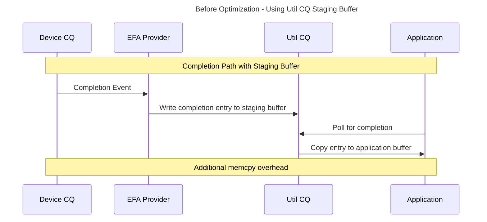
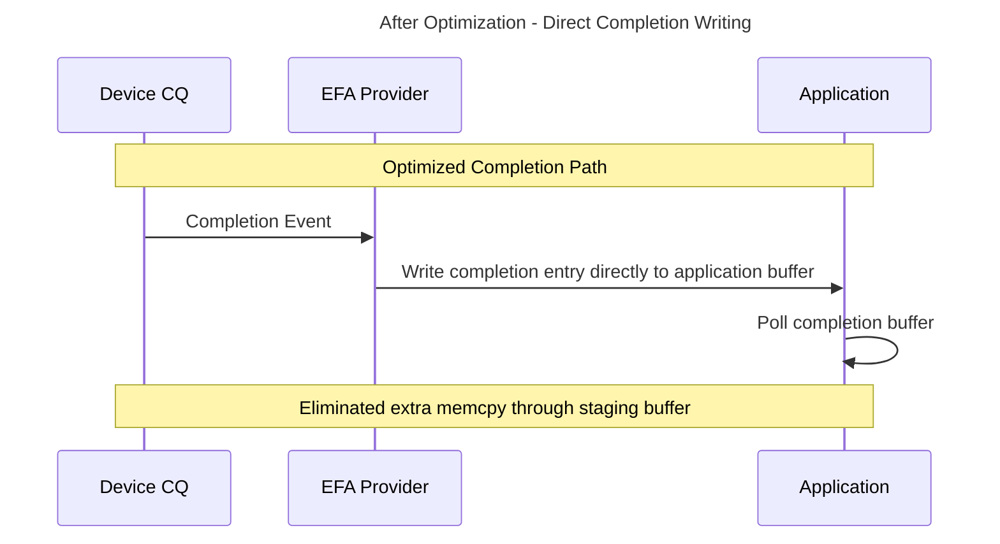
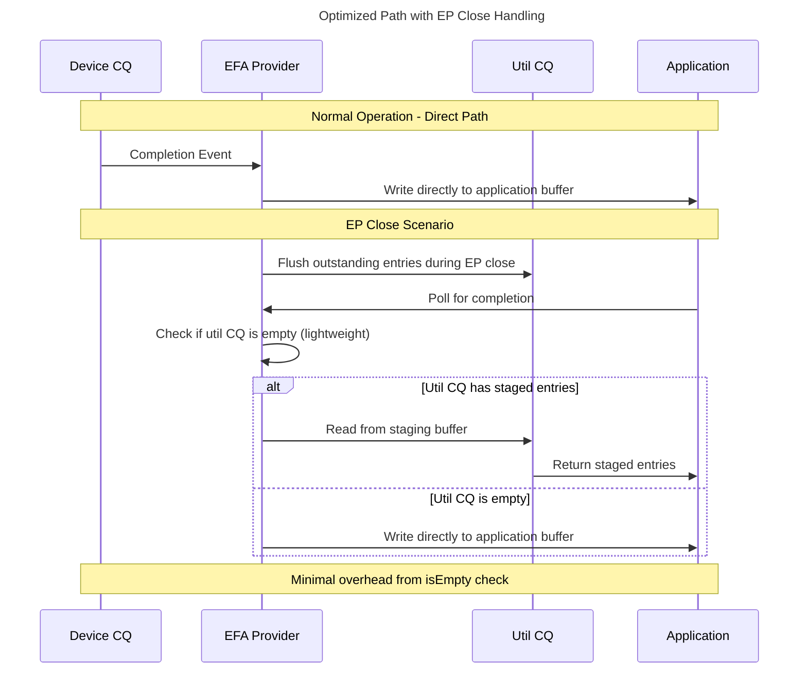
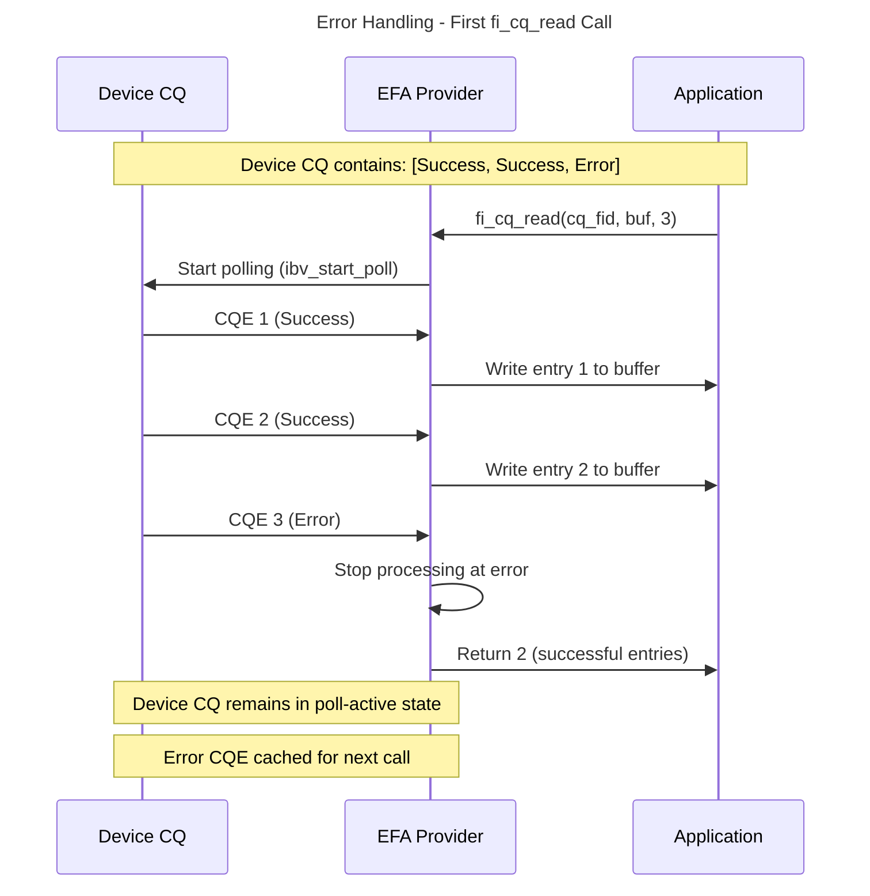
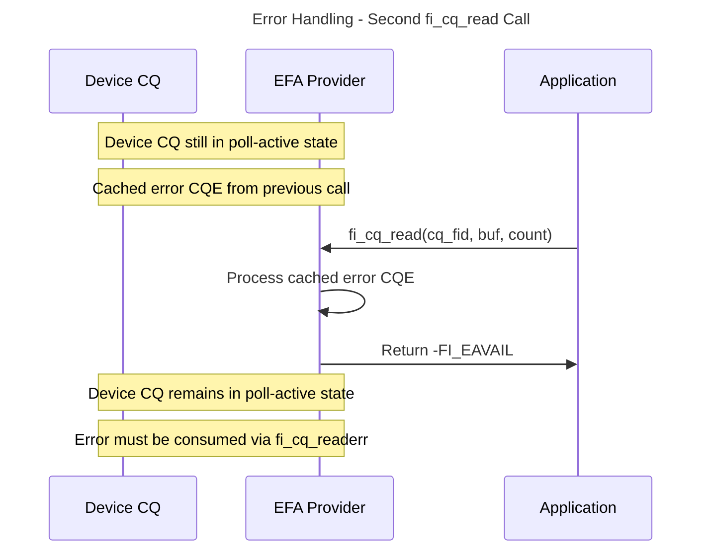
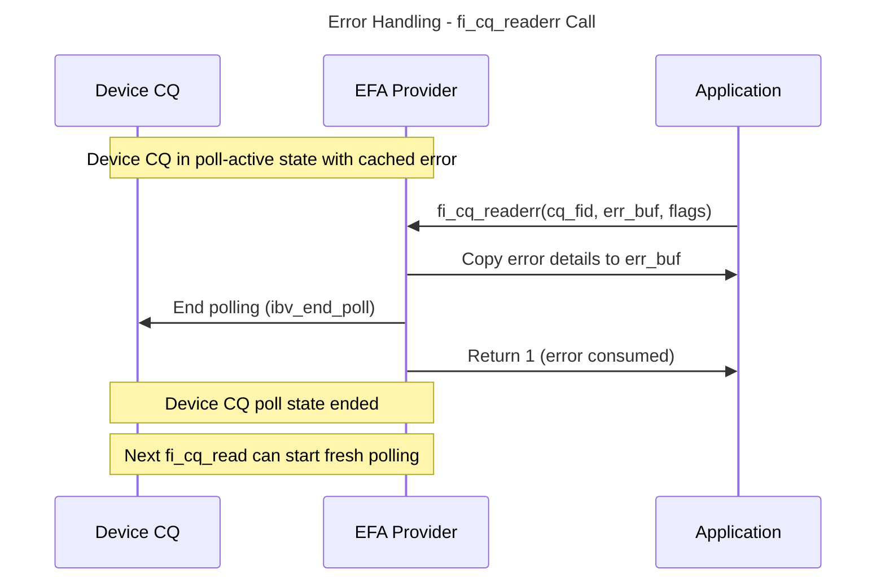

# Util CQ Bypass Optimization

## Overview

Completion queues ([fi_cq](https://ofiwg.github.io/libfabric/main/man/fi_cq.3.html)) are critical resources in libfabric that applications poll to receive completion notifications for asynchronous operations. This document illustrates a performance optimization that eliminates unnecessary memory copies in the completion path.

## Problem Statement

Before the optimization, libfabric providers followed a two-stage completion process:
1. Provider receives completion events from the NIC device
2. Provider writes completion entries to a staging buffer (util_cq)
3. Application polls the completion queue
4. Util CQ copies entries from staging buffer to application-provided buffer

This approach introduced additional memory copy operations that added latency and consumed CPU cycles, particularly impacting high-frequency completion scenarios.

## Solution: Direct Completion Writing

The optimization bypasses the util CQ staging buffer by enabling providers to write completion entries directly to the application-provided buffer. This eliminates the intermediate staging step and its associated memory copy overhead.

### Performance Benefits
- **Reduced Latency**: Eliminates one memory copy operation per completion
- **Lower CPU Overhead**: Fewer memory operations reduce CPU utilization
- **Improved Cache Efficiency**: Direct writes reduce memory bandwidth usage
- **Better Scalability**: Performance gains increase with completion frequency

### When This Optimization Applies
This optimization is currently available in:
- **EFA-direct fabric**: Direct completion writing bypasses util CQ staging

This optimization is **not available** when:
- **Counter is bound to CQ**: Applications can call `fi_cntr_read()` to get completion counts without reading CQ entries, requiring staging for deferred CQ reads
- **EFA fabric (non-direct)**: Staging is required to support `fi_cq_read()` with NULL buffer and 0 entries for provider progress in `FI_PROGRESS_MANUAL` mode

The key factor is whether CQ entry staging is necessary. Staging is required when applications need to:
- Progress the provider without consuming completion entries
- Read completion counts independently of CQ entry consumption

## Implementation Comparison

## Special Case: EP Close Handling
During endpoint closure, both EFA and EFA-direct fabrics flush any outstanding completion entries from the device CQ and stage them into util CQ. To handle this corner case, the optimized CQ read path includes a lightweight check at the beginning to verify if util CQ is empty. If staged entries exist, they are read from util CQ first. This isEmpty check adds minimal overhead to the fast path.

## Error Handling in Direct CQ Read Path

The optimized CQ read path maintains proper error handling semantics while preserving the poll state across multiple function calls. When a failed completion is encountered, the provider stops processing and maintains the device CQ in a poll-active state until the error is consumed.

### Error Handling Flow

Consider a scenario with 3 completion entries in the device CQ: 2 successful completions followed by 1 failed completion.

### Key Error Handling Characteristics

- **Poll State Persistence**: The device CQ remains in poll-active state across multiple `fi_cq_read()` calls until the error is consumed
- **Error Caching**: Failed CQEs are cached to ensure they're returned on subsequent `fi_cq_read()` calls
- **Atomic Error Consumption**: Only `fi_cq_readerr()` ends the poll state and allows progression to subsequent CQEs
- **Consistent Semantics**: Error handling behavior matches standard libfabric CQ semantics despite the direct write optimization

## Code References

**Util CQ staging implementation:**
- [util_cq.c:263](https://github.com/ofiwg/libfabric/blob/main/prov/util/src/util_cq.c#L263) - Core util CQ staging logic

**EFA provider's previous staging approach:**
- [efa_cq.c:137-168](https://github.com/ofiwg/libfabric/blob/main/prov/efa/src/efa_cq.c#L137-L168) - How EFA used util CQ for staging completions

**EFA provider's optimized direct completion path:**
- [efa_cq.c:686-783](https://github.com/ofiwg/libfabric/blob/main/prov/efa/src/efa_cq.c#L686-L783) - New CQ read implementation with direct writing